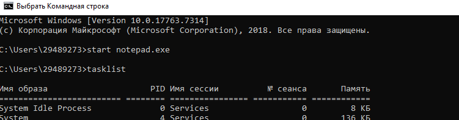
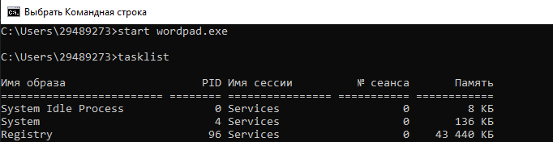
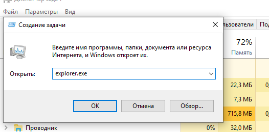
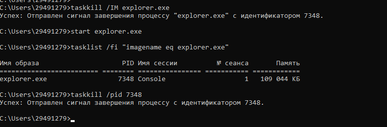

# Лабораторная работа номер 2
## Задача 2: запуск программы "Блокнот", отслеживание выполнения и завершение процесса, запуск WordPad.

Запуск блокнота через cmd:

Отслеживание выполнения notepad.exe с помощью tasklist:

Завершение процесса notepad.exe:

Запуск WordPad:

Отслеживание выполнения wordpad.exe с помощью tasklist:

## Задача 3: Продемонстрировать запуск процесса explorer.exe из диспетчера задач и командной строки.

Запуск explorer.exe через cmd:

Запуск explorer.exe через диспетчер задач:

Отслеживание выполнения explorer.exe через tasklist:
