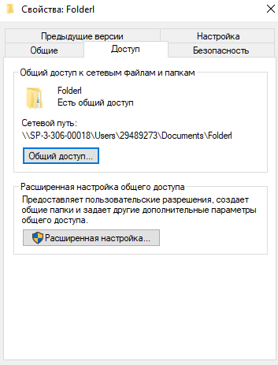
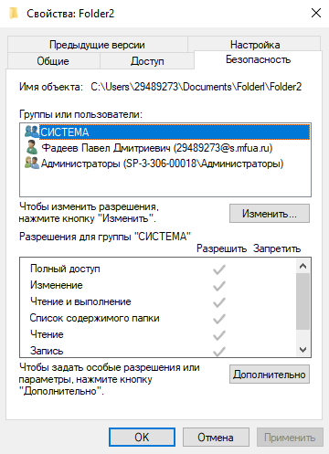

# Лабораторная работа № 3. Использование приёмов работы с файловой системой NTFS. Назначение разрешений доступа к файлам и папкам.

## Цель работы: Научиться устанавливать разрешения NTFS для файлов и для папок для отдельных пользователей и групп в операционной системы Windows ХР, а также устранять проблемы доступа к ресурсам.

## Задача: провести различные действия над папками под различными учетными записями

**Доступы у папки Folderl**

**Разрешения у папки Folderl**

**Доступы у папки Folder2**

**Разрешения у папки Folder2**
