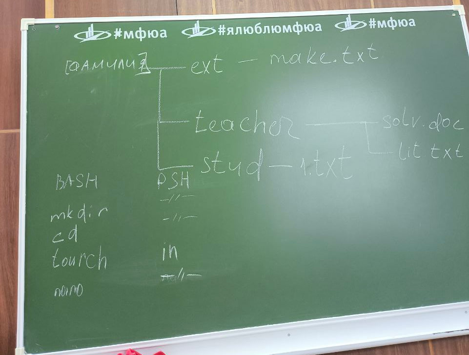
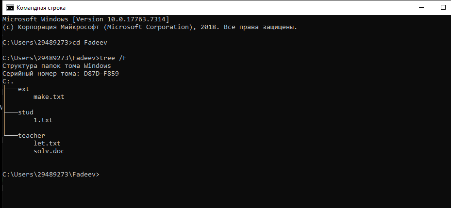

# Лабораторная работа номер 1.

**Цель работы:** Развитие профессиональных навыков работы в командной строке Windows.

**Задачи работы:**

– Создание структуры каталогов;

– Создание, просмотр, редактирование, удаление файлов;

– Удаление структуры каталогов;

– Манипулирование операционной системой Windows с помощью командной строки.

## Решение:

