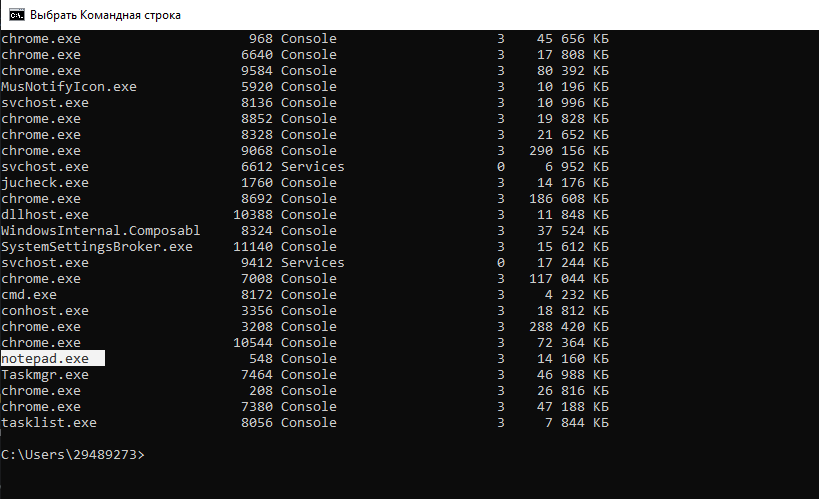
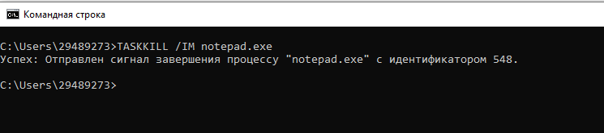
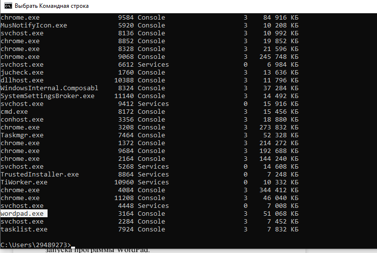
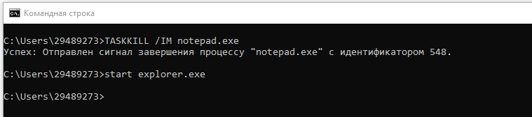

# Лабораторная работа номер 2

**Цель работы:** Практическое знакомство с управлением вводом/выводом в операционных системах Windows и кэширования операций ввода/вывода.

# План проведения занятия:

1. Ознакомиться с краткими теоретическими
сведениями.

3. Ознакомиться с назначением и основными
функциями Диспетчера задач Windows.

5. Приобрести навыки применения командной строки
Windows. Научиться запускать останавливать и проверять
работу процессов.

7. Сделать выводы о взаимосвязи запушенных
процессов и оперативной памятью компьютера.

9. Подготовить отчет для преподавателя о выполнении
лабораторной работы и записать его в папку «Выполнение».

# Ход работы

# Задание 1. Работа с Диспетчером задач Windows.

1. Запустите Windows;

2. Запуск диспетчера задач можно осуществить
двумя способами:

1 ) Нажатием сочетания клавиш Ctrl+Alt+Del. При
использовании данной команды не стоит пренебрегать
последовательностью клавиш. Появится меню, в котором
курсором следует выбрать пункт «Диспетчер задач».

2 ) Переведите курсор на область с показаниями
системной даты и времени и нажмите правый клик, будет
выведено меню, в котором следует выбрать «Диспетчер задач».

3. В диспетчере задач есть 6 вкладок:

1 ) Приложения;

2 ) Процессы;

3 ) Службы;

4 ) Быстродействие;

5 ) Сеть;

6 ) Пользователи.

Вкладка «Приложения» отображает список запущенных
задач (программ) выполняющиеся в настоящий момент не в
фоновом режиме, а также отображает их состояние. Также в
данном окне можно снять задачу переключиться между
задачами и запустить новую задачу при помощи
соответствующих кнопок.

Вкладка «Процессы» отображает список запущенных
процессов, имя пользователя запустившего процесс, загрузку
центрального процессора в процентном соотношении, а также
объем памяти используемого для выполнения процесса. Также
присутствует возможность отображать процессы всех
пользователей, либо принудительного завершения процесса.
Процесс — выполнение пассивных инструкций компьютерной
программы на процессоре ЭВМ.

Вкладка «Службы» показывает, какие службы
запущены на компьютере. Службы— приложения,
автоматически запускаемые системой при запуске ОС Windows
и выполняющиеся вне зависимости от статуса пользователя.

Вкладка «Быстродействие» отображает в графическом
режиме загрузку процессора, а также хронологию
использования физической памяти компьютера. Очень
эффективным инструментом наблюдения является «Монитор
ресурсов». С его помощью можно наглядно наблюдать за
каждой из сторон «жизни» компьютера. Подробное изучение
инструмента произвести самостоятельно, интуитивно.

Вкладка «Сеть» отображает подключенные сетевые
адаптеры, а также сетевую активность.

Вкладка «Пользователи» отображает список
подключенных пользователей.

4. Потренируйтесь в завершении и повторном запуске
процессов.

5. Разберите мониторинг загрузки и использование
памяти.

6. Попытайтесь запустить новые процессы при
помощи диспетчера, для этого можно использовать команды:
cmd, msconfig.

## Задача 2: запуск программы "Блокнот", отслеживание выполнения и завершение процесса, запуск WordPad.

**Запуск блокнота через cmd:**            

**Отслеживание выполнения notepad.exe с помощью tasklist:**          

 
**Завершение процесса notepad.exe:**        

**Запуск WordPad:**          

**Отслеживание выполнения wordpad.exe с помощью tasklist:**          

## Задача 3: Продемонстрировать запуск процесса explorer.exe из диспетчера задач и командной строки.

**Запуск explorer.exe через cmd:**         

**Запуск explorer.exe через диспетчер задач:**          

**Отслеживание выполнения explorer.exe через tasklist:**           
