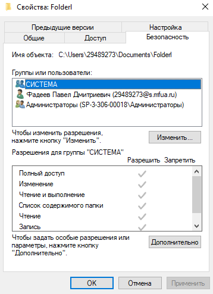
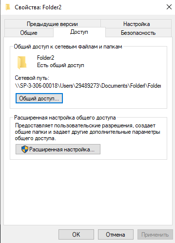

# Лабораторная работа № 3. Использование приёмов работы с файловой системой NTFS. Назначение разрешений доступа к файлам и папкам.

**Цель работы:** Научиться устанавливать разрешения NTFS для файлов и для папок для отдельных пользователей и групп в операционной системы Windows ХР, а также устранять проблемы доступа к ресурсам.

**Задача:** провести различные действия над папками под различными учетными записями.

### Общие сведения об использовании разрешений NTFS
Разрешения NTFS позволяют явно указать, какие пользователи и группы имеют доступ к файлам и папкам, и какие операции с их содержимым разрешено выполнять.
* Применимы только к томам, отформатированным в файловой системе NTFS (не предусмотрены для FAT или FAT32).
* Система безопасности эффективна независимо от того, обращается ли пользователь к файлу локально или по сети.
* Разрешения для папок отличаются от разрешений для файлов.
* Право назначать разрешения имеют: администраторы, владельцы файлов/папок и пользователи с разрешением «Полный доступ».

### Список управления доступом (ACL)
В NTFS для каждого файла и папки хранится список управления доступом (Access Control List - ACL).
* В ACL перечислены пользователи и группы, имеющие права доступа к ресурсу, а также сами назначенные разрешения.
* Для получения доступа в ACL должна присутствовать запись — элемент списка управления доступом (Access Control Entry - ACE) для конкретного пользователя или его группы.
* ACE назначает запрашиваемый тип доступа (например, «Чтение»). Если соответствующей ACE нет, доступ запрещается.

### Множественные разрешения и наследование
* **Множественные разрешения:** Пользователю можно установить несколько разрешений напрямую или через группы, членом которых он является.
* **Эффективные разрешения:** Представляют собой совокупность всех разрешений пользователя. Например, если пользователь имеет право «Чтение» для папки, а его группа — право «Запись», то у данного пользователя будут оба этих права.
* **Установка разрешений NTFS и особых разрешений:** При настройке безопасности следует руководствоваться принципом минимально необходимых привилегий для выполнения рабочих задач.

---

**Доступы у папки Folderl:**                 

**Разрешения у папки Folderl:**                 

**Доступы у папки Folder2:**                   

**Разрешения у папки Folder2:**                  

## Вывод
В ходе выполнения лабораторной работы были освоены базовые и продвинутые механизмы управления доступом на уровне файловой системы NTFS. Изучены принципы функционирования списков ACL и записей ACE. На практике закреплены навыки назначения разрешений для учетных записей и групп, проанализированы механизмы наследования и вычисления эффективных прав. Также были изучены методы диагностики и устранения типовых проблем с доступом, связанных с конфликтом разрешающих и запрещающих правил.