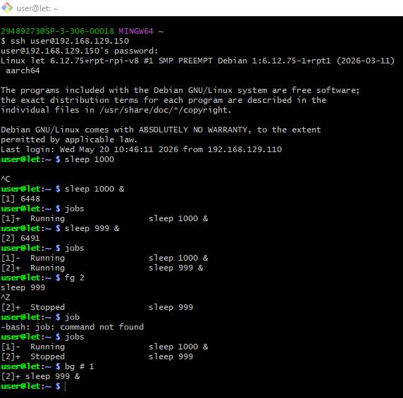
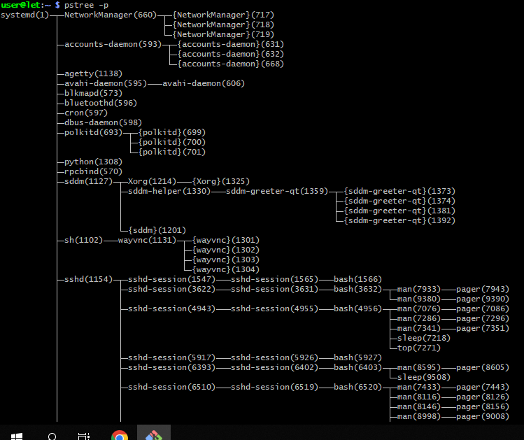
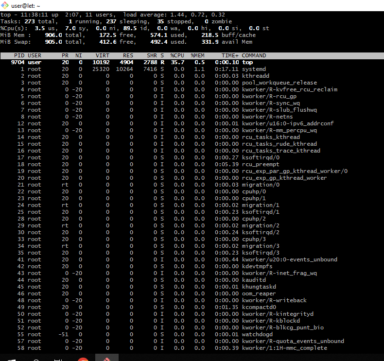
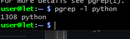
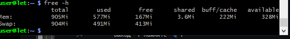
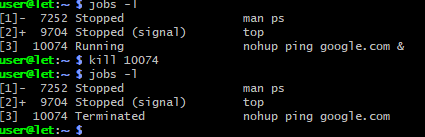

# Работа с процессами в Linux

## Цель работы

Изучение жизненного цикла процессов в операционной системе Linux, освоение практических навыков управления режимами их выполнения, мониторинга системных ресурсов и способов корректного завершения задач.

### Задачи работы:
- Запуск задачи в активном и фоновом режиме;
- Заставить задачу выполнятся после выхода из системы;
- Отслеживать и сортировать активные процессы;
- Завершать процессы;
- Постараемся разобрать следующие понятия:


### Команды:
* Fg (foreground) и bg (background);
* Nohup (no hang up);
* Ps - информация об активных процессах;
* Pstree - дерево процессов;
* Pgrep - поиск процессов;
* Pkill - завершение процессов;
* Top - диспетчер задач;
* Free - загрузка оперативной памяти;
* Uptime - время и полнота загрузки;
* Screen - управление сессиями.


### Запуск в фоне, приостановка процесса, просмотр фоновых задач, перевод в фон и активный режим: 



### Утилита `nohup` (No Hang Up)
Игнорирует сигнал закрытия терминала. Вывод автоматически перенаправляется в файл `nohup.out`.
```bash
nohup ping google.com &
```
---


### Команда `ps` (Статический снимок процессов)
* `ps aux` — показывает процессы всех пользователей с подробностями.
Команда grep - отсортировать.
```bash
ps aux | grep sleep
```

### Команда `pstree` (Дерево процессов)
Показывает иерархию (родительские и дочерние процессы).
```bash
pstree -p
```
*(Флаг `-p` выводит PID процессов).*



### Команда `top` (Динамический диспетчер задач)


Отображает процессы в реальном времени.

### Поиск процессов: `pgrep`
Находит PID (идентификатор) процесса по его имени.
```bash
pgrep -l python
```



## 4. Мониторинг ресурсов системы

### Команда `free` (Оперативная память)
Показывает объем занятой и свободной памяти RAM и Swap.
```bash
free -h
```
*(Флаг `-h` выводит данные в удобном для чтения виде: Мб, Гб).*



### Команда `uptime` (Время работы и нагрузка)
Показывает текущее время, время аптайма, количество пользователей и среднюю нагрузку за 1, 5 и 15 минут.
```bash
uptime
```

---


## 5. Завершение процессов

Уничтожение процессов происходит путем отправки им сигналов (например, `SIGTERM` или `SIGKILL`).

### Команда `kill`
Завершает процесс по его `PID`.
```bash
kill 1234
```


*Если процесс не реагирует (принудительное завершение):*
```bash
kill -9 1234
```


### Команда `pkill`
Завершает процессы по их **имени**, а не по PID.
```bash
pkill -9 ping
```
