# Лабораторная работа по системе журналирования в Linux

## Цель работы разобрать, как использовать утилиту journalctl в основных режимах.

Просмотрим все имеющиеся в системе часовые пояса:

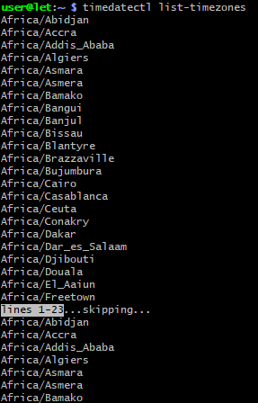

Найдем пояс, установим его, проверим, правильное ли время используется (командой timedatectl с опцией status).

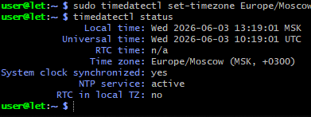

Просмотр содержимого журнала Информацию, собранную демоном journald, просматривают командой Linux journalctl. Если ее применяют отдельно, вывод журнала будет представлять многостраничный список с размещением старых записей наверху:
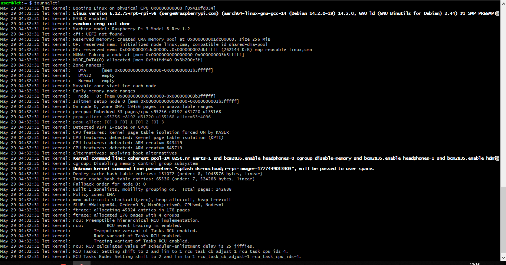

Отфильтруем журнал по времени.

Вывод журналов текущей загрузки Самый простой и часто используемый флаг: -b. Он помогает просмотреть записи журнала, которые были собраны с момента последнего по времени включения компьютера (или перезагрузки):
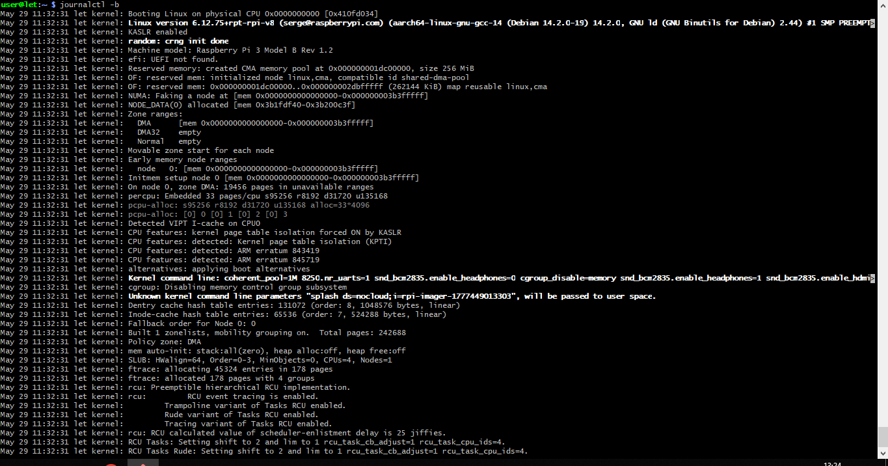

## Предыдущие загрузки

Команда для редактирования конфигурационного файла системы ведения журналов systemd:
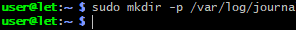

## Временные окна

На серверах, работающих без перезапуска, актуальность сведений по загрузке системы практически нулевая. Зато полезна информация о ключевых событиях, которую будем искать при помощи опций –since и –until, ограничивающих вывод записей утилитой journalctl по времени. После внесенного или до приведенного значения (формат YYYY-MM-DD HH:MM:SS).

Пример ввода команды:
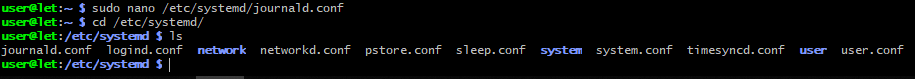

Если указать только время, система автоматически подставит текущую дату. Вместо неуказанного времени подставляется значение 00:00:00. То же происходит при пропуске поля секунд, которое обычно непринципиально для изучения ситуации. Есть возможность применять «относительные» значения, например yesterday (вчера).
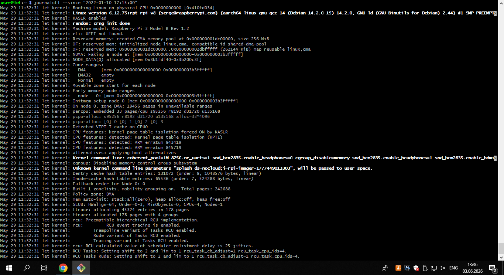

Пример команды, когда требуется получить отчет по сбоях, произошедших 1 час назад:
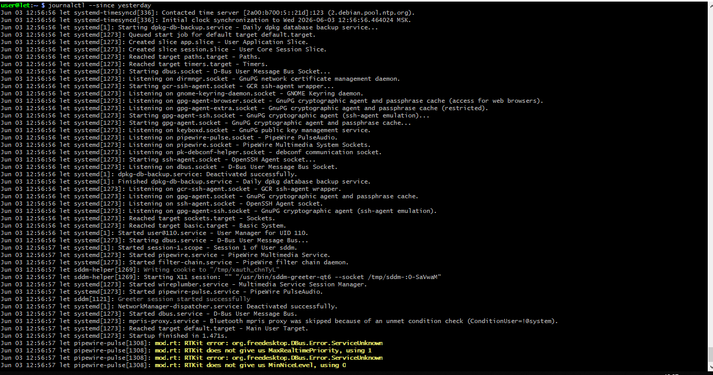

## Фильтр по значимости
### По единицам
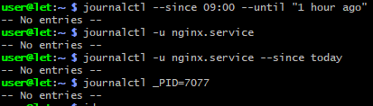

### По пути компонента и  отображение сообщений ядра:
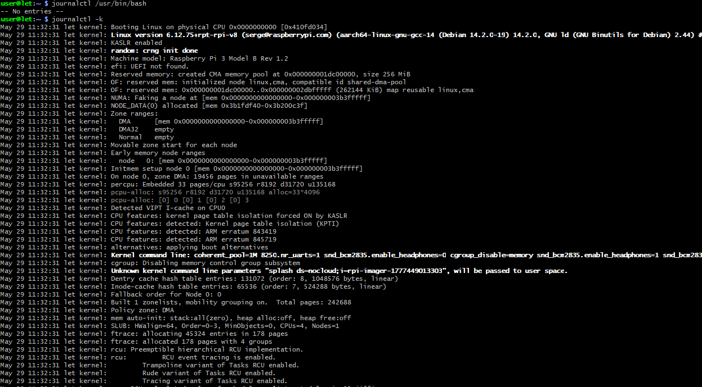

В стандартный вывод попадают сообщения только из текущего сеанса. Но пользователю доступна возможность указания другого. Например, для получения данных по «пятому сеансу» загрузки от текущего используем команду:
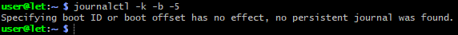

### По приоритету
Интересна фильтрация по приоритету сообщений. Это позволяет временно убрать информацию с низким приоритетом, чтобы не отвлекаться и не путаться при изучении ситуации. Выполняется операция при помощи опции -p с добавкой категории сообщений. Например, просмотрим все ошибки:
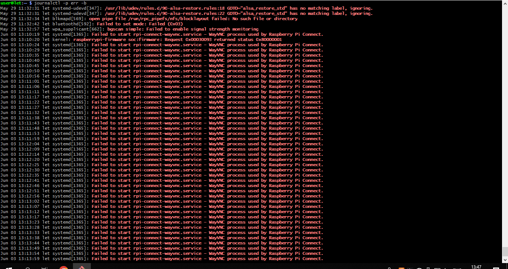

## Вывод
Мы разобрали, как использовать утилиту journalctl в основных режимах. Она весьма полезна для системных администраторов за счет гибкой фильтрации данных при чтении журналов. Расширение функций осуществляется за счет применения различных опций, основные из которых рассмотрели в текущей работе