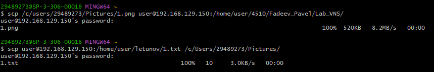

# Лабораторная работа: подключение к Raspberry PI по протоколу VNC

Для подключения к Raspberry Pi вам понадобится следующее:

- ваш Raspberry Pi и устройство с клиентом VNC, подключенные к одной сети (например, домашней беспроводной сети или VPN)

- имя хоста или IP-адрес вашего Raspberry Pi

- действительное имя пользователя и пароль для учетной записи на вашем Raspberry Pi

**Вход через TigerVNS:**  

**Окно входа:**            

**Загрузка данного скриншота по ssh и скачивание файла 1.txt из каталога letunov/:**

